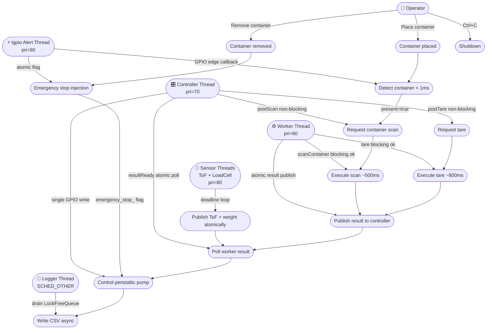
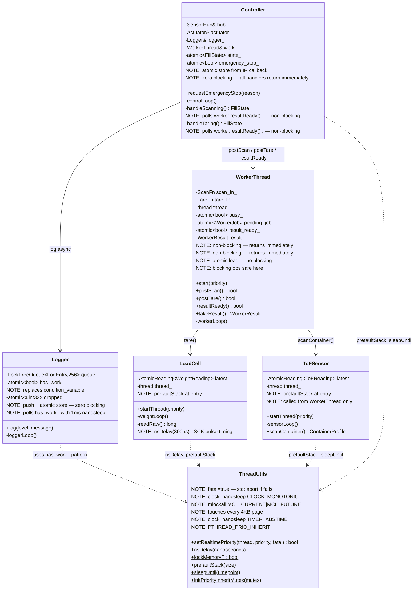
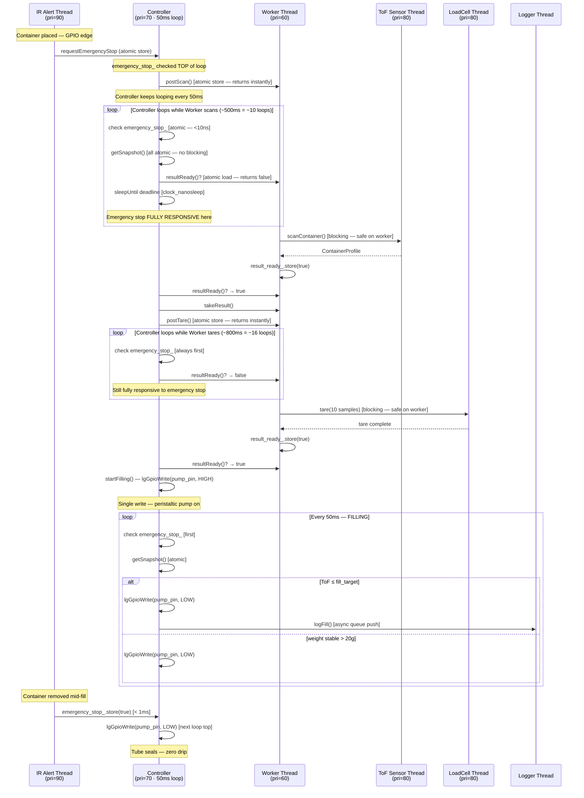
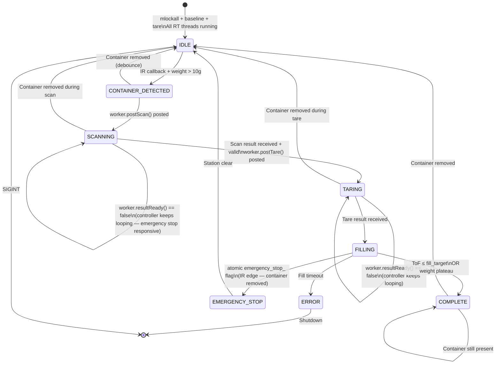
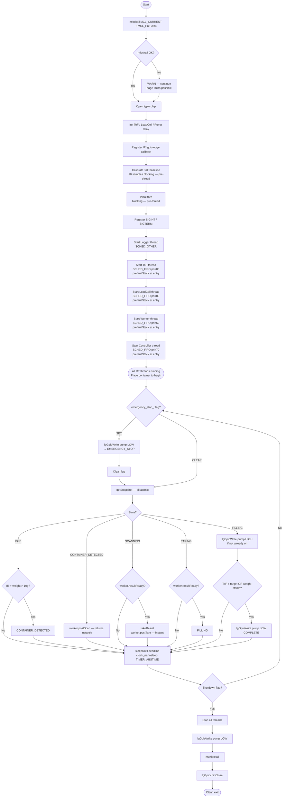
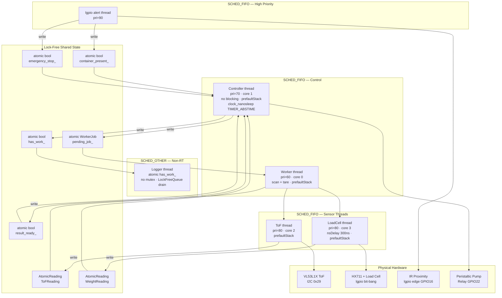
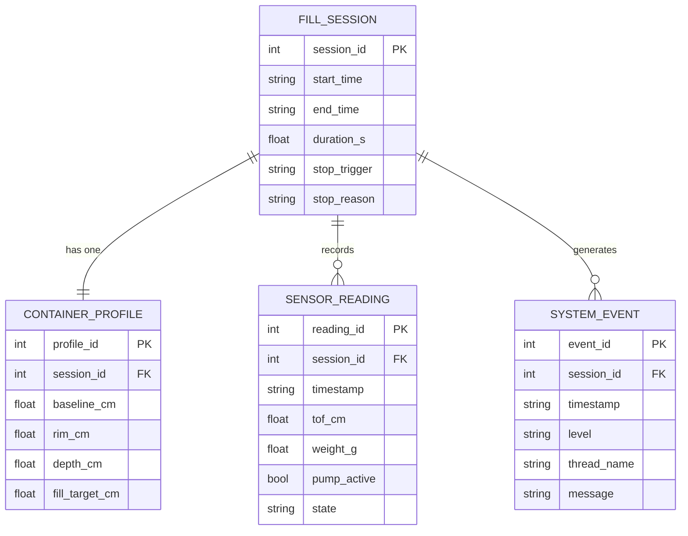

# HydroPHAI φ 💧⚡

> **HydroPHAI** — *Hydro* (Greek: liquid/water) · *PHAI* (Physical Hardware AI) · *φ* (phi: fluid dynamics flow rate symbol)
>
> **Genuinely real-time adaptive filling system — **


---

## 📌 Overview

**HydroPHAI** *(φ — phi, fluid dynamics flow rate symbol)* is a fully autonomous adaptive filling system for Raspberry Pi 5. Place any container — bottle, mug, jug, shot glass — and the system detects it, profiles its geometry, and fills it precisely with zero operator input.


---

## 🚀 Getting Started

### Prerequisites

```bash
sudo apt update && sudo apt upgrade -y
sudo apt install -y cmake g++ liblgpio-dev libi2c-dev i2c-tools
```

### Build

```bash
git clone https://github.com/RTEP5220/Hydro-PHI.git
cd Hydro-PHI
mkdir build && cd build
cmake ..
make -j4
```

### Run

```bash
# Must run as root for SCHED_FIFO, mlockall, and GPIO access
sudo ./Hydro-PHI
```

On startup you should see:

```
[RT] Process memory locked (MCL_CURRENT | MCL_FUTURE)
[ToF]      Sensor thread started (SCHED_FIFO pri=80)
[LoadCell] Thread started (SCHED_FIFO pri=80)
[Worker]   Thread started (SCHED_FIFO pri=60 core=0)
[Controller] Thread started (SCHED_FIFO pri=70 core=1)
```

If you see `[RT] FATAL: Cannot set SCHED_FIFO` — run with `sudo` or configure `/etc/security/limits.conf`.

### Tests (no hardware required)

```bash
cd build && ./Hydro-PHI_tests
```

---

## 🧩 Software Engineering Models

---

### 1. 📋 Use Case Diagram



---

### 2. 🏗️ Class Diagram (UML)



---

### 3. 🔄 Sequence Diagram — v6 Non-Blocking Scan + Tare



---

### 4. 🔁 State Machine



---

### 5. 🔃 Activity Diagram — v6 RT Startup Sequence



---

### 6. 🧱 Component Diagram



---

### 7. ⚡ Emergency Stop — Full Signal Chain

```
GPIO 16 falling edge (container removed)

lgpio alert thread (pri=90, any core)
  └── lgpioAlertCallback() — fires in < 100µs
        └── container_present_.store(false)     [atomic]
        └── user_callback_(false)               [SensorHub::onIREvent]
              └── emergency_cb_("Container removed during fill")
                    └── Controller::requestEmergencyStop()
                          └── emergency_stop_.store(true)  [atomic, < 1µs]

Controller thread (pri=70, core 1, 50ms loop)
  └── TOP of next loop iteration (worst case: current loop deadline + 50ms)
        └── emergency_stop_.load() == true      [< 10ns]
              └── lgGpioWrite(pump_pin, LOW)     [single write — pump off]
              └── Peristaltic tube self-seals    [zero drip, zero back-flow]
              └── state_ = EMERGENCY_STOP        [atomic store]

Total worst-case: < 50ms from GPIO edge to pump off
Tube sealed: immediately on motor stop
```

---

### 8. 🗃️ ER Diagram



---

## 🧪 Tests

```bash
cd build && ./Hydro-PHI_tests
```

---

## 📄 License

[MIT License](LICENSE) — Copyright © 2026 HydroPHAI

---

<p align="center">
**HydroPHAI φ**<br/>⚡ Genuinely Real-Time · 🔒 Lock-Free ·<br/>
HydroPHAI φ · Raspberry Pi 5 · C++17 ·
</p>

---
