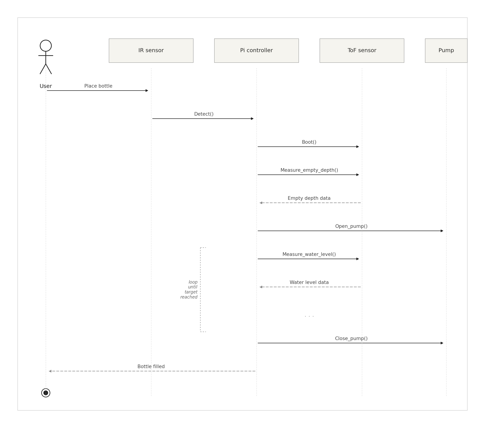
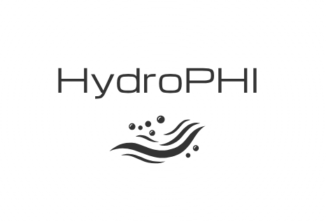

# HydroPHI φ 💧

> **HydroPHI** — *Hydro* (Greek: liquid/water) · *φ* (phi: fluid dynamics flow rate symbol)
>
> **Genuinely real-time adaptive filling system — **


---

## Overview

**HydroPHI** *(φ — phi, fluid dynamics flow rate symbol)* is a fully autonomous adaptive filling system for Raspberry Pi 5. Place any container — bottle, mug, jug, shot glass — and the system detects it, profiles its geometry, and fills it precisely with zero operator input.

---

## 📋 Agenda

- [Bill of Materials](#-bill-of-materials)
- [Getting Started](#-getting-started)
- [Tests](#-tests)
- [License](#-license)
- [Connect with Us](#-connect-with-us)

---

## 🧾 Bill of Materials

| Component | Qty |
|---|---|
| Raspberry Pi 5 | 1 |
| VL53L0X V2 ToF Laser Sensor module | 1 |
| HX711 Load Cell ADC breakout module | 1 |
| 5kg Load Cell (strain gauge, 4-wire) | 1 |
| IR Proximity Sensor (digital output) | 1 |
| Peristaltic Pump 12V DC | 1 |
| 5V Relay Module (single channel) | 1 |
| Silicone Tubing 6mm ID × 1m | 1 |
| Dispensing Nozzle 6mm | 1 |

---

## 📐 UML Sequence Diagram

This section outlines the planned UML sequence diagram for the HydroPHI automatic water filling system. The diagram shows the steps taken by the system after a user places a bottle on the platform.

The process begins when the user places a bottle, triggering the IR proximity sensor. The IR sensor signals the Pi controller, which boots the time-of-flight sensor and requests an initial depth measurement to compute the empty volume of the bottle. The Pi then opens the pump and enters a measurement loop: it continuously polls the ToF sensor for the current water level and compares it against the fill target.

When the water level reaches the target, the Pi closes the pump and signals the user that the bottle is filled.



---

## 🚀 Getting Started

### Prerequisites

```bash
sudo apt update && sudo apt upgrade -y
sudo apt install -y cmake g++ liblgpio-dev libi2c-dev i2c-tools
```

### Build

```bash
git clone https://github.com/RTEP5220/Hydro-PHI.git
cd Hydro-PHI
mkdir build && cd build
cmake ..
make -j4
```

### Run

```bash
# Recommended GPIO Config Coming Later.
sudo ./build/hphi
```
---

## 📄 License

[MIT License](LICENSE) — Copyright © 2026 HydroPHI

---

## 📱 Connect with Us

<p align="left">
<a href="https://www.instagram.com/hydro_phi" target="blank">Follow our Instgram Page ! </a></br>

<a href="https://www.youtube.com/@hydrophi" target="blank">Subscribe to our Youtube Channel.</a>
</p>


<p align="left">
 </br>
</p>


<p align="center">
**HydroPHI φ**<br/>⚡ Genuinely Real-Time · 🔒 Lock-Free · Raspberry Pi 5 · C++17<br/>
HydroPHI φ · Team_3 Real-Time Embedded Programming . University of Glasgow
</p>
