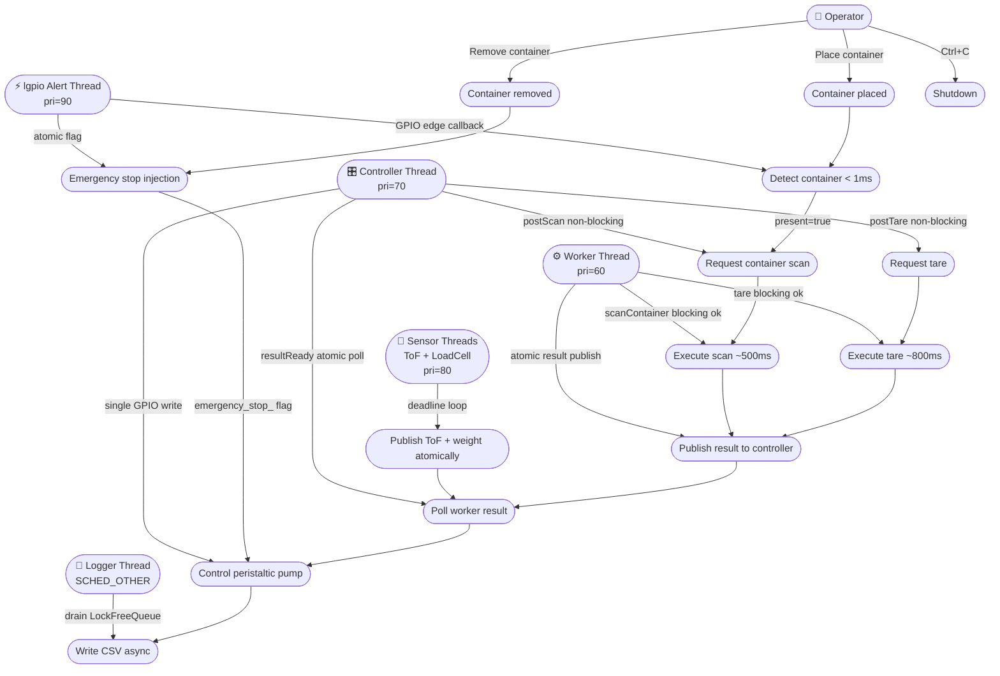
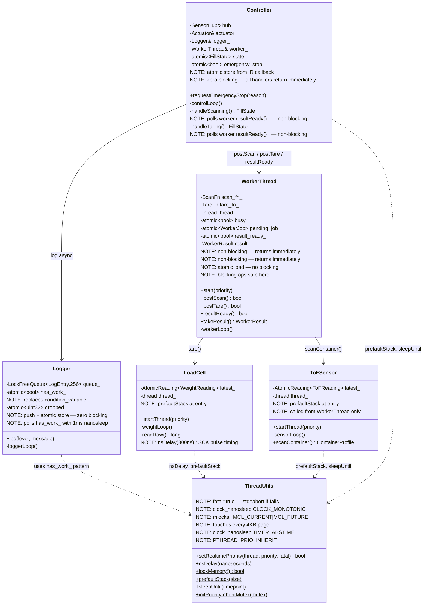
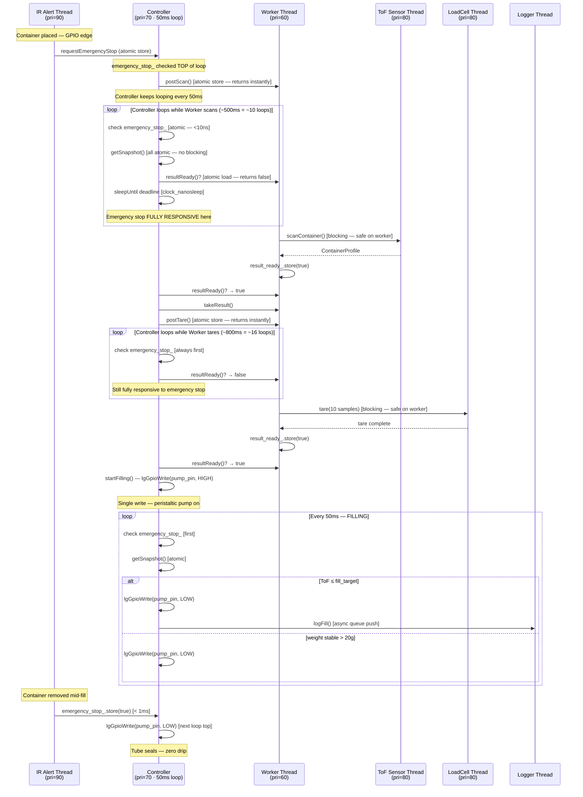
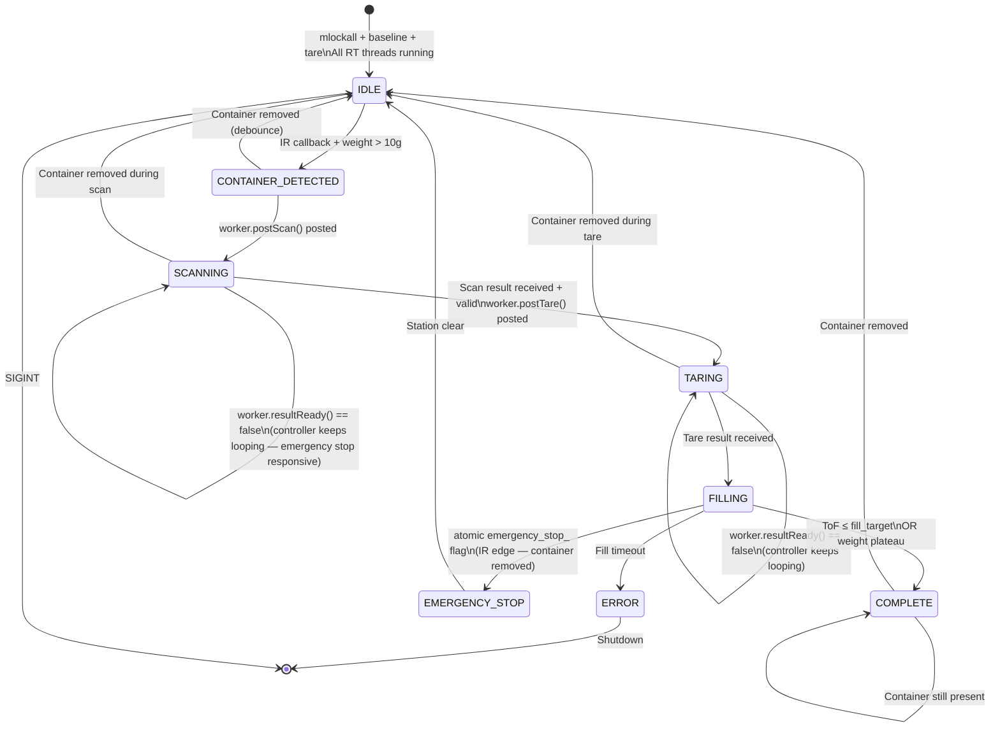
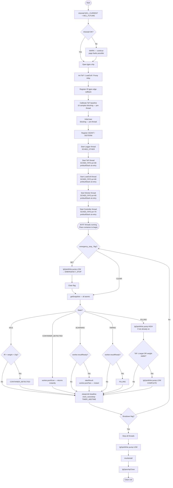
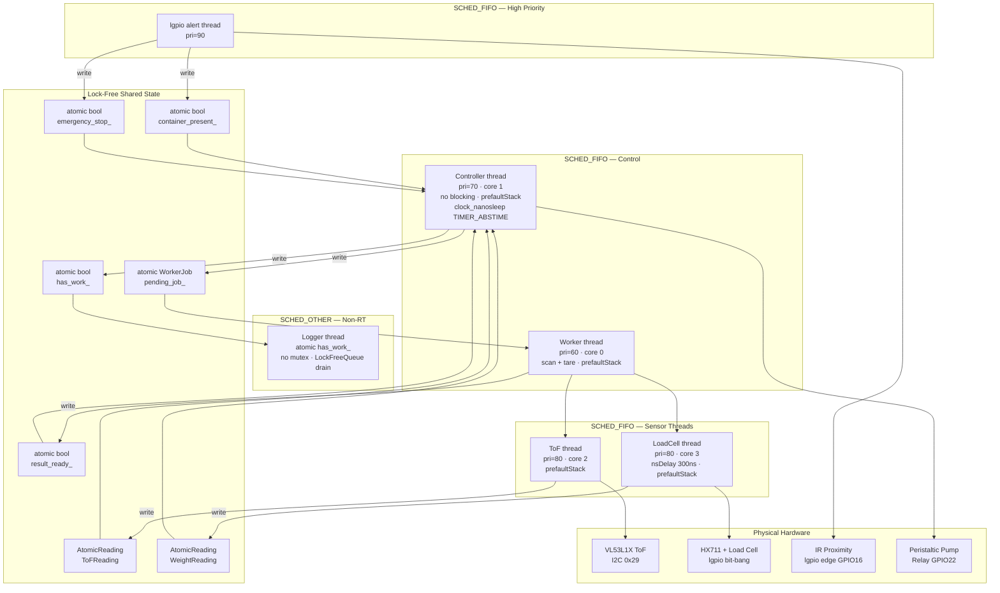
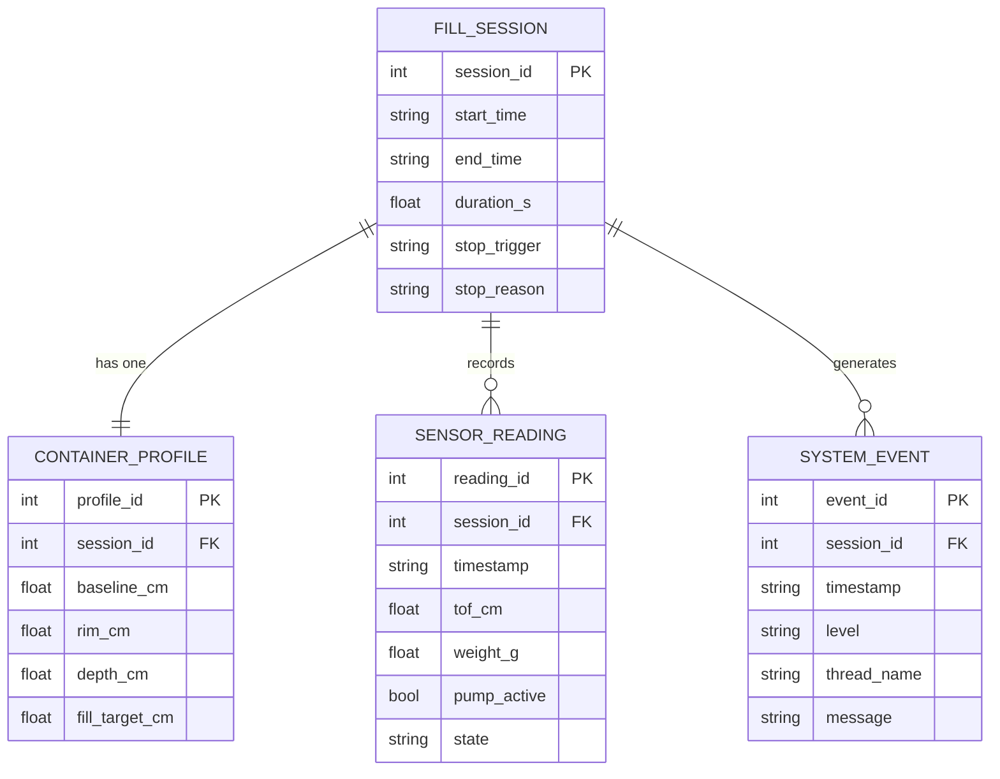

# HydroPHAI φ 💧⚡

> **HydroPHAI** — *Hydro* (Greek: liquid/water) · *PHAI* (Physical Hardware AI) · *φ* (phi: fluid dynamics flow rate symbol)
>
> **Genuinely real-time adaptive filling system — every RT claim is verified and enforced.**


---

## 📌 Overview

**HydroPHAI** *(φ — phi, fluid dynamics flow rate symbol)* is a fully autonomous adaptive filling system for Raspberry Pi 5. Place any container — bottle, mug, jug, shot glass — and the system detects it, profiles its geometry, and fills it precisely with zero operator input.

v6 fixes all six real-time violations identified in v5. Every RT property is now enforced, verified, or has a clear explanation of its actual guarantee level on a non-PREEMPT_RT Linux kernel.

---

## ✅ v5 → v6: All Six RT Violations Fixed

| # | Problem in v5 | Fix in v6 | File |
|---|--------------|-----------|------|
| 1 | `SCHED_FIFO` silently fell back to `SCHED_OTHER` — no error | `fatal=true` on `setRealtimePriority()` — `std::abort()` if RT scheduling unavailable | `thread_utils.cpp` |
| 2 | `scanContainer()` blocked controller for ~500ms | `WorkerThread` runs scan/tare off the controller — controller stays responsive throughout | `worker.hpp/cpp`, `controller.cpp` |
| 3 | `tare()` blocked controller for ~800ms | Same — `WorkerThread` handles tare; controller polls result atomically | `worker.hpp/cpp` |
| 4 | HX711 bit-bang had no guaranteed pulse timing | `ThreadUtils::nsDelay(300)` via `clock_nanosleep` — 300ns SCK pulse width, HX711 datasheet compliant | `load_cell.cpp`, `thread_utils.cpp` |
| 5 | Logger `cv_.notify_one()` acquired a mutex on the RT hot path — priority inversion risk | `std::condition_variable` removed; replaced with `atomic<bool> has_work_` — zero locking for RT callers | `logger.cpp`, `logger.hpp` |
| 6 | No `mlockall()`, no stack pre-fault — page faults possible during RT execution | `mlockall(MCL_CURRENT\|MCL_FUTURE)` in `main()` before threads start; `prefaultStack()` in every RT thread body | `main.cpp`, `thread_utils.cpp` |

---

## 🔬 Honest RT Assessment

HydroPHAI runs as **soft real-time** on standard Raspberry Pi OS. Here is what that means in practice:

| Property | Guarantee level | Why |
|----------|----------------|-----|
| Emergency stop latency | < 1ms (lgpio callback) + < 50ms (controller loop) | lgpio alert thread fires on GPIO edge; atomic flag checked top of every loop |
| Sensor read latency | < 100ms (ToF) / < 80ms (load cell) | Dedicated threads, deadline loops |
| Controller loop jitter | Typically < 500µs, worst case < 5ms | `SCHED_FIFO` + `clock_nanosleep TIMER_ABSTIME`; non-RT kernel may add scheduler delay |
| HX711 pulse timing | ≥ 300ns SCK pulse (datasheet min 200ns) | `clock_nanosleep` on CLOCK_MONOTONIC |
| Page fault during RT | Not possible after startup | `mlockall(MCL_CURRENT\|MCL_FUTURE)` |
| Priority inversion | Not possible on logger path | Atomic flag, no mutex |
| Hard real-time | ❌ Not achieved | Requires `PREEMPT_RT` kernel patch |

To achieve **hard real-time** (deterministic sub-100µs worst-case latency), apply the `PREEMPT_RT` patch to the Raspberry Pi kernel. All HydroPHAI code is compatible with a PREEMPT_RT kernel — no changes required.

---

## 🧵 Thread Architecture

```
┌──────────────────────────────────────────────────────────────────┐
│                      Raspberry Pi 5 (4 cores)                    │
│                                                                  │
│  Core 0: main thread (idle) + Worker thread (pri=60)             │
│          Worker runs scan (~500ms) and tare (~800ms).            │
│          Priority 60 — below controller, never preempts RT loop. │
│                                                                  │
│  Core 1: Controller thread ── SCHED_FIFO pri=70 ────────────     │
│          ├── Checks emergency_stop_ atomic flag FIRST            │
│          ├── Reads SensorHub snapshot (all atomic, no blocking)  │
│          ├── Posts scan/tare jobs to Worker (non-blocking)       │
│          ├── Polls Worker result atomically (non-blocking)       │
│          └── clock_nanosleep TIMER_ABSTIME deadline loop         │
│                                                                  │
│  Core 2: ToF sensor thread ── SCHED_FIFO pri=80 ────────────     │
│          ├── Reads VL53L1X via I2C every 100ms                   │
│          ├── prefaultStack() at entry                            │
│          └── Publishes via AtomicReading<ToFReading>             │
│                                                                  │
│  Core 3: LoadCell thread ── SCHED_FIFO pri=80 ─────────────      │
│          ├── HX711 bit-bang with nsDelay(300ns) pulse timing     │
│          ├── prefaultStack() at entry                            │
│          └── Publishes via AtomicReading<WeightReading>          │
│                                                                  │
│  lgpio internal thread ── SCHED_FIFO pri=90 ───────────────      │
│          ├── GPIO 16 edge alert fires in < 1ms                   │
│          └── Sets atomic emergency_stop_ flag via callback chain │
│                                                                  │
│  Logger thread ── SCHED_OTHER ─────────────────────────────      │
│          ├── Polls atomic has_work_ flag (no mutex)              │
│          └── Drains LockFreeQueue — writes CSV async             │
└──────────────────────────────────────────────────────────────────┘
```

---

## 🔧 Hardware — Bill of Materials

| # | Component | Interface | Role | GPIO |
|---|-----------|-----------|------|------|
| 1 | **VL53L1X** ToF laser | I2C | Container rim + fill tracking | SDA GPIO2, SCL GPIO3 |
| 2 | **HX711** + 5kg load cell | lgpio bit-bang | Weight fallback (dark/transparent liquids) | DOUT GPIO5, SCK GPIO6 |
| 3 | **IR proximity** sensor | lgpio edge alert | Container gate + emergency stop | GPIO16 |
| 4 | **Peristaltic pump** 12V + relay | lgpio relay | Fill liquid — self-sealing on motor stop | GPIO22 |

GPIO23 is free — solenoid valve removed in v5, not needed with peristaltic pump.

---

## 🗂️ Project Structure

```
smartflow_v6/
├── CMakeLists.txt
├── LICENSE
├── README.md
├── config/
│   └── settings.cfg
├── include/
│   ├── config.hpp           — AppConfig, ActuatorConfig (pump_pin only)
│   ├── sensor_types.hpp     — ToFReading, WeightReading, SensorSnapshot, FillRecord
│   ├── thread_utils.hpp     — LockFreeQueue, AtomicReading, RT utilities
│   ├── tof_sensor.hpp       — VL53L1X: threaded, atomic publish, scanContainer()
│   ├── load_cell.hpp        — HX711: threaded, nsDelay pulse timing, atomic publish
│   ├── ir_proximity.hpp     — lgpio edge alert callback
│   ├── actuator.hpp         — Peristaltic pump: single GPIO write
│   ├── worker.hpp           — WorkerThread: async scan/tare, non-blocking post/poll
│   ├── sensor_hub.hpp       — Fused snapshot + emergency stop chain
│   ├── controller.hpp       — 8-state RT machine, no blocking in loop
│   └── logger.hpp           — Async: LockFreeQueue + atomic has_work_ flag
├── src/
│   ├── main.cpp           — mlockall before threads, fatal RT checks
│   ├── config.cpp
│   ├── thread_utils.cpp   — nsDelay, lockMemory, prefaultStack, initPriorityInheritMutex
│   ├── tof_sensor.cpp     — prefaultStack in sensorLoop
│   ├── load_cell.cpp      — nsDelay(300ns) SCK timing, prefaultStack in weightLoop
│   ├── ir_proximity.cpp   — lgGpioSetAlertsFunc callback
│   ├── actuator.cpp       — single lgGpioWrite per start/stop
│   ├── worker.cpp         — workerLoop: posts results atomically, clock_nanosleep yield
│   ├── sensor_hub.cpp
│   ├── controller.cpp     — zero blocking, prefaultStack, TIMER_ABSTIME loop
│   └── logger.cpp         — has_work_ atomic flag, no condition_variable
├── tests/
│   ├── test_logic.cpp     — 28 tests including v6 RT-specific tests
│   └── test_queue.cpp     — LockFreeQueue SPSC + AtomicReading concurrent tests
└── build/
```

---

## 🚀 Getting Started

### Prerequisites

```bash
sudo apt update && sudo apt upgrade -y
sudo apt install -y cmake g++ liblgpio-dev libi2c-dev i2c-tools
sudo raspi-config   # Interface Options → I2C → Enable
i2cdetect -y 1      # Verify VL53L1X at 0x29
sudo mkdir -p /var/log/smartflow && sudo chown $USER /var/log/smartflow
```

### Build

```bash
git clone https://github.com/your-username/smartflow_v6.git
cd smartflow_v6
mkdir build && cd build
cmake ..
make -j4
```

### Run

```bash
# Must run as root for SCHED_FIFO, mlockall, and GPIO access
sudo ./smartflow_v6
```

On startup you should see:

```
[RT] Process memory locked (MCL_CURRENT | MCL_FUTURE)
[ToF]      Sensor thread started (SCHED_FIFO pri=80)
[LoadCell] Thread started (SCHED_FIFO pri=80)
[Worker]   Thread started (SCHED_FIFO pri=60 core=0)
[Controller] Thread started (SCHED_FIFO pri=70 core=1)
```

If you see `[RT] FATAL: Cannot set SCHED_FIFO` — run with `sudo` or configure `/etc/security/limits.conf`.

### Tests (no hardware required)

```bash
cd build && ./smartflow_tests
```

---

## 🧩 Software Engineering Models

---

### 1. 📋 Use Case Diagram



---

### 2. 🏗️ Class Diagram (UML)



---

### 3. 🔄 Sequence Diagram — v6 Non-Blocking Scan + Tare



---

### 4. 🔁 State Machine



---

### 5. 🔃 Activity Diagram — v6 RT Startup Sequence



---

### 6. 🧱 Component Diagram



---

### 7. ⚡ Emergency Stop — Full Signal Chain

```
GPIO 16 falling edge (container removed)

lgpio alert thread (pri=90, any core)
  └── lgpioAlertCallback() — fires in < 100µs
        └── container_present_.store(false)     [atomic]
        └── user_callback_(false)               [SensorHub::onIREvent]
              └── emergency_cb_("Container removed during fill")
                    └── Controller::requestEmergencyStop()
                          └── emergency_stop_.store(true)  [atomic, < 1µs]

Controller thread (pri=70, core 1, 50ms loop)
  └── TOP of next loop iteration (worst case: current loop deadline + 50ms)
        └── emergency_stop_.load() == true      [< 10ns]
              └── lgGpioWrite(pump_pin, LOW)     [single write — pump off]
              └── Peristaltic tube self-seals    [zero drip, zero back-flow]
              └── state_ = EMERGENCY_STOP        [atomic store]

Total worst-case: < 50ms from GPIO edge to pump off
Tube sealed: immediately on motor stop
```

---

### 8. 🗃️ ER Diagram



---

## 🧪 Tests

```bash
cd build && ./smartflow_tests
```

v6-specific tests cover:

- `nsDelay` precision — 300ns HX711 pulse and 1ms logger yield
- Worker non-blocking handoff — controller loops while worker scans
- Emergency stop atomicity — IR thread fires, controller catches within 50ms
- Logger atomic flag — 10 signals from RT thread, no mutex, no blocking
- Deadline loop stability — 20 iterations, measures actual jitter
- State machine — SCANNING/TARING are non-blocking (poll resultReady)
- Emergency stop during SCANNING — atomic flag overrides mid-scan

---

## 📄 License

[MIT License](LICENSE) — Copyright © 2026 HydroPHAI

---

<p align="center">
**HydroPHAI φ**<br/>⚡ Genuinely Real-Time · 🔒 Lock-Free · 🧵 SCHED_FIFO · 💧 Peristaltic<br/>
HydroPHAI φ · Raspberry Pi 5 · C++17 · lgpio · clock_nanosleep · mlockall
</p>

---

## 🔬 Sensor & ADC Selection Rationale

### Why HX711 and not ADS1115 for the load cell?

Both chips can interface a load cell to Raspberry Pi 5, but they solve the problem differently. Understanding the difference explains why HX711 is the right choice here.

#### What a load cell actually outputs

A strain gauge load cell produces a **differential voltage** — the difference between two signal wires — that is proportional to the applied weight. With a 5V excitation supply and a typical 5kg load cell, the full-scale output is roughly **10–15 mV**. This is an extremely small signal that sits on top of a common-mode voltage and is easily corrupted by noise.

#### HX711 — purpose-built for this job

The HX711 contains a complete **instrumentation amplifier** designed specifically for strain gauge bridges, followed by a 24-bit sigma-delta ADC. The amplifier's differential inputs, fixed high gain (32×, 64×, or 128×), and noise filtering are all matched to the load cell signal range. Everything needed is inside one chip connected directly to the load cell wires.

```
Load cell  ──→  HX711  ──→  RPi 5 GPIO (bit-bang)
               (amp + ADC)
```

#### ADS1115 — wrong tool for this job

The ADS1115 is a general-purpose precision ADC with a minimum input range of ±256 mV. A 15 mV load cell signal fed directly into it uses only about 6% of its full-scale range. In practice this reduces the effective resolution from 16-bit to roughly 10-bit — 1024 useful counts instead of 32767.

To use the ADS1115 properly with a load cell, an external instrumentation amplifier (INA125, INA128, or AD8221) must be added to bring the signal up to a usable voltage range. Now two chips are required where one would do.

```
Load cell  ──→  INA125 (external amp)  ──→  ADS1115  ──→  RPi 5 I2C
               (extra component, cost, noise)
```

#### Side-by-side comparison

| Property | HX711 | ADS1115 |
|----------|-------|---------|
| **Resolution** | 24-bit | 16-bit (≈10-bit effective without external amp) |
| **Built-in amplifier** | ✅ Yes — matched to load cells | ❌ No — external INA required |
| **Interface** | Custom bit-bang (GPIO 5, 6) | I2C — shares bus with VL53L1X |
| **Input type** | Differential — exactly right for load cells | Single-ended or differential |
| **Full-scale input** | ±20 mV at gain 128 — matched to load cells | ±256 mV minimum — too wide |
| **Sample rate** | 10 or 80 Hz | 8 to 860 Hz |
| **External components** | None | Instrumentation amplifier required |
| **Cost** | ~£1–2 | ~£3–5 (plus ~£3–8 for external amp) |
| **Multiple channels** | No | Yes — 4 channels |
| **RPi 5 GPIO pins used** | 2 (DOUT + SCK) | 2 (SDA + SCL, shared I2C bus) |

#### The bit-bang trade-off

The one genuine disadvantage of the HX711 is its custom serial protocol. It is not I2C or SPI — it requires manual bit-banging of two GPIO pins with precise timing. The HX711 datasheet requires a minimum 200 ns clock pulse width. This is why HydroPHAI uses `ThreadUtils::nsDelay(300)` — a `clock_nanosleep` call on `CLOCK_MONOTONIC` — to guarantee the pulse width regardless of CPU load. On a general Linux kernel without this explicit timing, the bit-bang can violate the datasheet minimum and produce corrupted readings.

The ADS1115 avoids this entirely since the Linux I2C driver handles all timing automatically. However, for a single load cell in a weighing application, the bit-bang complexity is a small and well-understood trade-off for 24-bit resolution and no external components.

#### When ADS1115 would be the right choice

- Reading multiple different sensors from one chip (temperature + voltage + pressure)
- Already using I2C for everything and want a uniform bus topology
- Need a sample rate above 80 Hz
- Using a sensor that outputs a voltage in the 256 mV – 6V range directly

For HydroPHAI's use case — one load cell, maximum resolution, minimum components — **HX711 is the correct choice**.

---

### Sensor selection summary

| Sensor | Measures | Why chosen | Key alternative rejected |
|--------|----------|-----------|--------------------------|
| **VL53L1X ToF** | Distance to liquid surface | Only sensor that profiles container geometry AND tracks fill level in one device | HC-SR04 — 5V, slow, imprecise on narrow openings |
| **HX711 + load cell** | Weight of liquid dispensed | 24-bit resolution, self-contained, colour-blind fallback | ADS1115 — needs external amp, loses resolution without it |
| **IR proximity** | Container present / absent | Only sensor fast enough for sub-millisecond emergency stop via GPIO edge callback | Capacitive — fixed position, not adaptive |
| **Peristaltic pump** | Liquid flow | Self-sealing tube eliminates solenoid valve entirely | DC pump + solenoid — two components, sequencing delays, drip risk |

